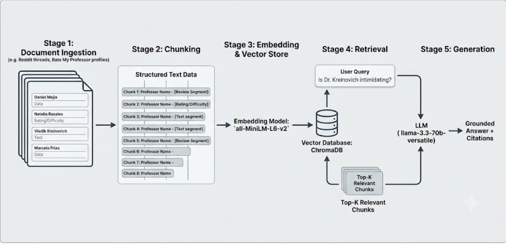

# Project 1 Planning: The Unofficial Guide

> Write this document before you write any pipeline code.
> Your spec and architecture diagram are what you'll use to direct AI tools (Claude, Copilot, etc.) to generate your implementation — the more specific they are, the more useful the generated code will be.
> Update the Retrieval Approach and Chunking Strategy sections if you change your approach during implementation.
> Update this file before starting any stretch features.

---

## Domain

<!-- What domain did you choose? Why is this knowledge valuable and hard to find through official channels? -->

I choose the Student reviews of CS professors at my university, UTEP. I find the knowledge valuable as students do not have clear path towards getting information for registrating for classes; specially since my school does not have official channels. Everything is just sort of ran trough word of mouth.

---

## Documents

<!-- List your specific sources: URLs, subreddit names, forum threads, or file descriptions.
     Aim for at least 10 sources that together cover different subtopics or perspectives within your domain. -->

| # | Source | Description | URL or location |
|---|--------|-------------|-----------------|
| 1 |Rate My Proffesor|Reviews|docuement/olac_fuentes|
| 2 | Rate My Proffesor|Reviews|docuement/Daniel_Mejia|
| 3 |Rate My Proffesor|Reviews|docuement/Marcelo_Frias|
| 4 | Rate My Proffesor|Reviews|docuement/Natalia_Rosales|
| 5 | Rate My Proffesor|Reviews|docuement/Vladik_Kreinovich|
| 6 | | | |
| 7 | | | |
| 8 | | | |
| 9 | | | |
| 10 | | | |

---

## Chunking Strategy

<!-- How will you split documents into chunks?
     State your chunk size (in tokens or characters), overlap size, and explain why those
     numbers fit the structure of your documents.
     A review-heavy corpus warrants different chunking than a long FAQ. -->

**Chunk size:**
Chunk Size: 500 characters (roughly 80–100 words). This is usually the perfect sweet spot to hold an entire RMP review—including its ratings and text—without cutting it off.

**Overlap:**
Chunk Overlap: 100 characters (roughly 15–20 words). Since some reviews are slightly longer or multi-sentenced, a 100-character overlap guarantees that if a crucial piece of advice is written right at the end of a review, it won't get chopped in half and lose its context.

**Reasoning:**

The reviews from RMP are brief, it will not be necessary to have a heavy chunk size approach.
---

## Retrieval Approach

<!-- Which embedding model are you using (e.g., all-MiniLM-L6-v2 via sentence-transformers)?
     How many chunks will you retrieve per query (top-k)?
     If you were deploying this for real users and cost wasn't a constraint, what tradeoffs
     would you weigh in choosing a different embedding model — context length, multilingual
     support, accuracy on domain-specific text, latency? -->

**Embedding model:**

"For our Unofficial Guide, we are utilizing the all-MiniLM-L6-v2 model via sentence-transformers to generate 384-dimensional dense vector embeddings locally. These embeddings will be indexed inside a local ChromaDB instance.

**Top-k:**

When a user submits a query, the system will perform a semantic similarity search to extract the Top-K (k=4) most relevant chunks. A baseline of k=4 ensures that the LLM receives multiple diverse student perspectives (capturing both praise and complaints across different semesters) without over-saturating the context window with loosely related noise."

**Production tradeoff reflection:**

Latency vs. Accuracy: Moving to a cloud-hosted frontier model (like OpenAI's text-embedding-3-large or Cohere's embeddings) increases context length limits and handles multi-language text significantly better, but introduces network API latency.

Storage Scales: While ChromaDB is perfect for a local project, a production app scaled to a whole university would require a cloud-managed vector database like Pinecone, Weaviate, or pgvector to handle millions of concurrent user vectors seamlessly.
---

## Evaluation Plan

<!-- List your 5 test questions with their expected correct answers.
     Questions should be specific enough that you can judge whether the system's response
     is right or wrong. "What are good dining halls?" is too vague.
     "What do students say about wait times at [dining hall name] during lunch?" is testable. -->

| # | Question | Expected answer |
|---|----------|-----------------|
| 1 |What specific advice do students give for passing Dr. Kreinovich's exams in CS 3350? | |
| 2 | | |
| 3 | | |
| 4 | | |
| 5 | | |

---

## Anticipated Challenges

<!-- What could go wrong? Name at least two specific risks with reasoning.
     Consider: noisy or inconsistent documents, missing source attribution, off-topic
     retrieval, chunks that split key information across boundaries. -->

1. Semantic Mixing of Professor Names (Entity Confusion): Because multiple Rate My Professor files use identical structural markers (like Quality:, Difficulty:, Tags:), a naive semantic search query about "grading criteria" might accidentally pull chunks from Dr. Fuentes when the user was asking about Dr. Mejia.

     Mitigation: Prepend the professor’s name and university metadata header to the text of every single chunk during the chunking phase so the LLM always has explicit context.

2. Cross-Course Data Noise (Mismatched Tags): In our collected data, some student reviews contain data entry errors on the source website (e.g., a student tagging a review header as CS2202 but writing in the text that they took CS5387). If the system relies purely on metadata filtering by course tags, it will miss critical text.

     Mitigation: Rely on dense vector semantic search across the entire review body string rather than strictly filtering by the categorical metadata tags.

---

## Architecture

<!-- Draw a diagram of your pipeline showing the five stages:
     Document Ingestion → Chunking → Embedding + Vector Store → Retrieval → Generation
     Label each stage with the tool or library you're using.
     You can use ASCII art, a Mermaid diagram, or embed a sketch as an image.
     You'll use this diagram as context when prompting AI tools to implement each stage. -->

     

---

## AI Tool Plan

<!-- For each part of the pipeline below, describe:
     - Which AI tool you plan to use (Claude, Copilot, ChatGPT, etc.)
     - What you'll give it as input (which sections of this planning.md, which requirements)
     - What you expect it to produce
     - How you'll verify the output matches your spec

     "I'll use AI to help me code" is not a plan.
     "I'll give Claude my Chunking Strategy section and ask it to implement chunk_text()
     with my specified chunk size and overlap" is a plan. -->

Component 1: Ingestion and Cleaning Pipeline

Input to Claude: Provide the ## Documents section of your planning.md and a sample snippet of your structured text format (showing the [REVIEW X] tags).

Expected Output: A Python script that loops through the .txt files, parses out the metadata headers, and strips out any remaining string fragments while maintaining review boundaries.

Component 2: Chunking Strategy Implementation

Input to Claude: Provide the ## Chunking Strategy spec (500-character size, 100-character overlap) and your ## Architecture diagram. Ask Claude specifically to use RecursiveCharacterTextSplitter from LangChain or a native paragraph splitter.

Expected Output: A modular chunk_text() function that cleanly splits reviews without separating critical sentences from their metadata context.

Component 3: ChromaDB Vector Storage and Retrieval

Input to Claude: Provide your Retrieval spec sheet and ask for an implementation of SentenceTransformer("all-MiniLM-L6-v2") integrated with a local ChromaDB collection.

Expected Output: A script that embeds the text chunks, maps the correct dictionary metadata (source file, professor name, course), and returns a query_vector_db() function that yields the top 4 chunks with distance scores.

Component 4: Grounded LLM Prompting via Groq

Input to Claude: Ask Claude to draft a system prompt for llama-3.3-70b-versatile that strictly enforces grounding rules: "Answer the user query ONLY using the provided text chunks. If the answer is not present, state 'I do not have enough student data to answer.' Include inline source citations."

Expected Output: A complete completion block utilizing the Groq SDK client that formats the retrieved contexts into the LLM system instructions cleanly.

**Milestone 3 — Ingestion and chunking:**

**Milestone 4 — Embedding and retrieval:**

**Milestone 5 — Generation and interface:**
